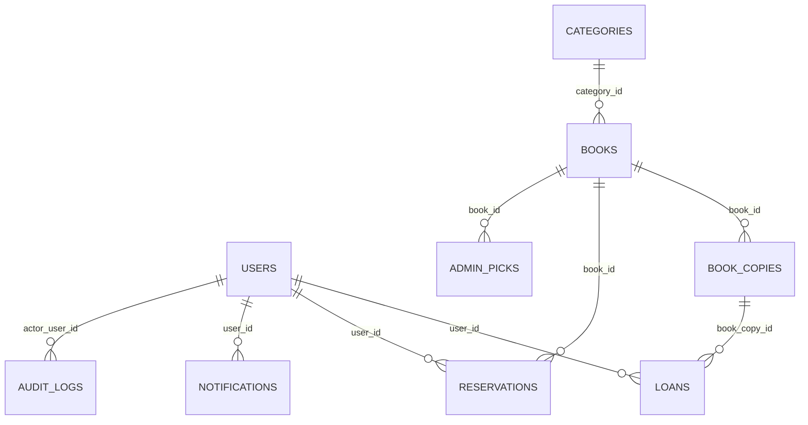

# LibraryHub テーブル定義書（MVP）

## 1. 目的
- 本書は [schema.sql](../schema.sql) を人間向けに読みやすく整理したテーブル定義書
- 対象DBは PostgreSQL 16

## 2. 型定義（ENUM）
- `role_type`: `ADMIN | USER`
- `user_status_type`: `ACTIVE | INACTIVE`
- `copy_status_type`: `AVAILABLE | ON_LOAN | RESERVED | INACTIVE`
- `loan_status_type`: `ON_LOAN | OVERDUE | RETURNED`
- `reservation_status_type`: `WAITING | NOTIFIED | FULFILLED | CANCELED`
- `notification_status_type`: `PENDING | SENT | READ | FAILED`
- `notification_type`: `DUE_SOON | OVERDUE_REMINDER | RESERVATION_AVAILABLE | SYSTEM`

## 3. テーブル一覧
- `users`: 利用者・管理者アカウント
- `categories`: 書籍カテゴリ
- `books`: 書誌情報
- `book_copies`: 複本（実物）情報
- `loans`: 貸出情報
- `reservations`: 予約情報
- `notifications`: 通知情報
- `admin_picks`: 管理者ピックアップ
- `audit_logs`: 監査ログ

## 3.1 テーブル関連図（ER）

## 4. テーブル定義

### 4.1 users
| 列名 | 型 | NOT NULL | デフォルト | 備考 |
|---|---|---|---|---|
| id | UUID | Yes | gen_random_uuid() | PK |
| employee_id | VARCHAR(64) | Yes | - | UNIQUE |
| email | VARCHAR(255) | Yes | - | UNIQUE |
| password_hash | TEXT | Yes | - | パスワードハッシュ |
| role | role_type | Yes | `USER` | ロール |
| status | user_status_type | Yes | `ACTIVE` | 利用状態 |
| created_at | TIMESTAMPTZ | Yes | NOW() | 作成日時 |
| updated_at | TIMESTAMPTZ | Yes | NOW() | 更新日時 |

### 4.2 categories
| 列名 | 型 | NOT NULL | デフォルト | 備考 |
|---|---|---|---|---|
| id | UUID | Yes | gen_random_uuid() | PK |
| name | VARCHAR(120) | Yes | - | UNIQUE |
| is_active | BOOLEAN | Yes | TRUE | 有効フラグ |
| created_at | TIMESTAMPTZ | Yes | NOW() | 作成日時 |
| updated_at | TIMESTAMPTZ | Yes | NOW() | 更新日時 |

### 4.3 books
| 列名 | 型 | NOT NULL | デフォルト | 備考 |
|---|---|---|---|---|
| id | UUID | Yes | gen_random_uuid() | PK |
| title | VARCHAR(255) | Yes | - | 書名 |
| author | VARCHAR(255) | Yes | - | 著者 |
| isbn | VARCHAR(32) | No | - | ISBN(任意) |
| publisher | VARCHAR(255) | No | - | 出版社(任意) |
| published_year | INTEGER | No | - | 1000-2999 のCHECK |
| category_id | UUID | Yes | - | FK -> categories.id |
| location | VARCHAR(255) | No | - | 保管場所(任意) |
| created_at | TIMESTAMPTZ | Yes | NOW() | 作成日時 |
| updated_at | TIMESTAMPTZ | Yes | NOW() | 更新日時 |

### 4.4 book_copies
| 列名 | 型 | NOT NULL | デフォルト | 備考 |
|---|---|---|---|---|
| id | UUID | Yes | gen_random_uuid() | PK |
| book_id | UUID | Yes | - | FK -> books.id（ON DELETE CASCADE） |
| copy_code | VARCHAR(64) | Yes | - | UNIQUE（管理用コード） |
| status | copy_status_type | Yes | `AVAILABLE` | 蔵書状態 |
| created_at | TIMESTAMPTZ | Yes | NOW() | 作成日時 |
| updated_at | TIMESTAMPTZ | Yes | NOW() | 更新日時 |

### 4.5 loans
| 列名 | 型 | NOT NULL | デフォルト | 備考 |
|---|---|---|---|---|
| id | UUID | Yes | gen_random_uuid() | PK |
| user_id | UUID | Yes | - | FK -> users.id |
| book_copy_id | UUID | Yes | - | FK -> book_copies.id |
| loaned_at | TIMESTAMPTZ | Yes | - | 貸出日時 |
| due_at | TIMESTAMPTZ | Yes | - | 返却期限 |
| returned_at | TIMESTAMPTZ | No | - | 返却日時 |
| extension_count | INTEGER | Yes | 0 | CHECK: 0〜1 |
| status | loan_status_type | Yes | `ON_LOAN` | 貸出状態 |
| created_at | TIMESTAMPTZ | Yes | NOW() | 作成日時 |
| updated_at | TIMESTAMPTZ | Yes | NOW() | 更新日時 |

制約:
- `due_at > loaned_at`
- `extension_count >= 0 AND extension_count <= 1`

### 4.6 reservations
| 列名 | 型 | NOT NULL | デフォルト | 備考 |
|---|---|---|---|---|
| id | UUID | Yes | gen_random_uuid() | PK |
| user_id | UUID | Yes | - | FK -> users.id |
| book_id | UUID | Yes | - | FK -> books.id（ON DELETE CASCADE） |
| priority | INTEGER | Yes | - | CHECK: `> 0` |
| status | reservation_status_type | Yes | `WAITING` | 予約状態 |
| created_at | TIMESTAMPTZ | Yes | NOW() | 作成日時 |
| notified_at | TIMESTAMPTZ | No | - | 通知日時 |
| canceled_at | TIMESTAMPTZ | No | - | キャンセル日時 |
| fulfilled_at | TIMESTAMPTZ | No | - | 成立日時 |

### 4.7 notifications
| 列名 | 型 | NOT NULL | デフォルト | 備考 |
|---|---|---|---|---|
| id | UUID | Yes | gen_random_uuid() | PK |
| user_id | UUID | Yes | - | FK -> users.id |
| type | notification_type | Yes | - | 通知種別 |
| message | TEXT | Yes | - | 通知本文 |
| scheduled_at | TIMESTAMPTZ | Yes | - | 通知予定日時 |
| sent_at | TIMESTAMPTZ | No | - | 送信日時 |
| read_at | TIMESTAMPTZ | No | - | 既読日時 |
| status | notification_status_type | Yes | `PENDING` | 通知状態 |
| created_at | TIMESTAMPTZ | Yes | NOW() | 作成日時 |

制約:
- `sent_at IS NULL OR sent_at >= scheduled_at`

### 4.8 admin_picks
| 列名 | 型 | NOT NULL | デフォルト | 備考 |
|---|---|---|---|---|
| id | UUID | Yes | gen_random_uuid() | PK |
| book_id | UUID | Yes | - | FK -> books.id（ON DELETE CASCADE） |
| start_at | TIMESTAMPTZ | Yes | - | 表示開始日時 |
| end_at | TIMESTAMPTZ | Yes | - | 表示終了日時 |
| priority | INTEGER | Yes | 100 | 表示優先度 |
| is_active | BOOLEAN | Yes | TRUE | 有効フラグ |
| created_at | TIMESTAMPTZ | Yes | NOW() | 作成日時 |
| updated_at | TIMESTAMPTZ | Yes | NOW() | 更新日時 |

制約:
- `end_at > start_at`

### 4.9 audit_logs
| 列名 | 型 | NOT NULL | デフォルト | 備考 |
|---|---|---|---|---|
| id | UUID | Yes | gen_random_uuid() | PK |
| actor_user_id | UUID | No | - | FK -> users.id（操作ユーザー） |
| action | VARCHAR(100) | Yes | - | 操作種別 |
| resource_type | VARCHAR(100) | Yes | - | 対象種別 |
| resource_id | UUID | No | - | 対象ID |
| payload | JSONB | Yes | `'{}'::jsonb` | 追加情報 |
| created_at | TIMESTAMPTZ | Yes | NOW() | 操作日時 |

## 5. 主要インデックス
- `books(title)`, `books(author)`, `books(isbn)`, `books(category_id)`
- `book_copies(book_id, status)`
- `loans(user_id, status)`, `loans(due_at, status)`, `loans(book_copy_id, status)`
- `reservations(book_id, status, priority)`, `reservations(user_id, status)`
- `notifications(user_id, status)`, `notifications(scheduled_at, status)`
- `admin_picks(is_active, start_at, end_at)`
- `audit_logs(created_at)`, `audit_logs(actor_user_id, created_at)`

## 6. 補足
- 時刻はDB上 `TIMESTAMPTZ` を使用し、`Asia/Tokyo` 基準で扱う
- 実装時は `updated_at` の自動更新（triggerまたはアプリ更新）を適用する
